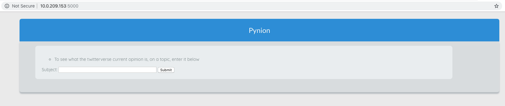
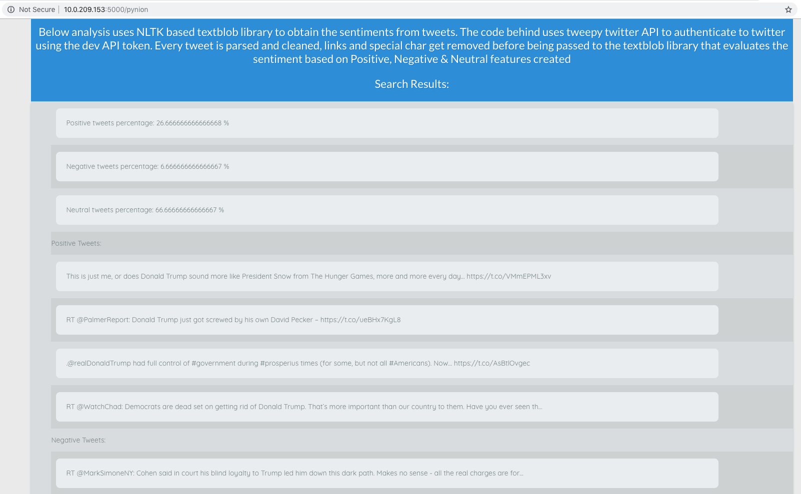

# Sentiment-Analyser

- This Program will utilise a Twitter API and perform Sentiment analysis on Tweets by using various algorithms.

- Setting up your Python enviroemnt:
1. virtualenv -p /usr/local/bin/python3 env
2. source env/bin/activate
3. pip3 install flask
4. pip3 install wtforms
5. pip install tweepy
6. pip install textblob
7. python -m textblob.download_corpora
  Note: If you encounter CERTIFICATE_VERIFY_FAILED error then
  from root of your terminal go to 'Applications --> Python 3.7 directory' using a new terminal window
  ```
  /$ cd cd Applications/Python\ 3.7/
  /Applications/Python 3.7 $ sudo -H ./Install\ Certificates.command
  and return back to the terminal where your step 7 failed and re-issue it.
  ```
8. to run > python app.py


For database

1. pip install flask-sqlalchemy
2. pip install flask_migrate


For testing using pytest
-------------------------
1. pip install pytest
2. pytest -v

test coverage
--------------
1. pip install coverage
2. coverage run /tests/test_basic.py
3. coverage report project/application path/*.py
4. coverage html project/users/*.py

for Flask testing // Flask-Testing==0.4
----------------------------------------
1. pip install Flask-Testing

Twitter API Instructions
------------------------
1. Register with twitter for API keys from https://developer.twitter.com/en.html
2. Ensure you use a new account and not personal twitter account
3. Activate the account, register 'pynion' app (Only after registering an app you will be able to generate keys)
  i. You will be asked to provide justification etc
  ii. Keep github link handy
4. Generate API and Access Token keys
5. From mac terminal (ensure to do this from your virtual env)
```
  export API_KEY=<YOUR API KEY WITHOUT ANYQUOTES OR BRACKETS> && export API_SECRET_KEY=<YOUR API SECRET KEY WITHOUT ANYQUOTES OR BRACKETS> && export ACCESS_TOKEN=<YOUR ACCESS TOKEN WITHOUT ANYQUOTES OR BRACKETS> && export ACCESS_TOKEN_SECRET=<YOUR ACCESS TOKEN SECRET WITHOUT ANYQUOTES OR BRACKETS>

```
6. In the terminal type ```printenv``` to see if the keys you created are listed. if not you have not created them under your virtualenv
7. The app is available to be accessed within the network hence if you run the app get your ip address from terminal and access it like ```ifconfig | grep inet``` you will find your ip next next to netmask that you can share with colleagues on the same network.

Initial Look
-------------




Word cloud

1. pip install wordcloud
2. pip install pandas
3. pip install numpy
4. pip install mapplotlib
5. pip install pillow
